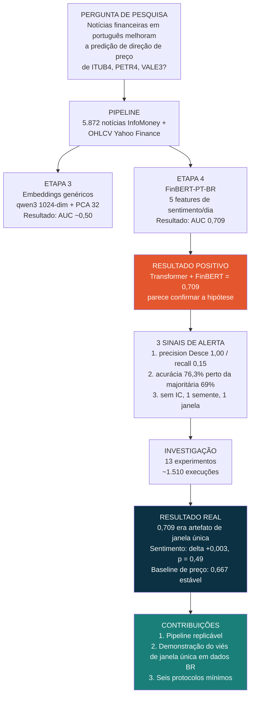
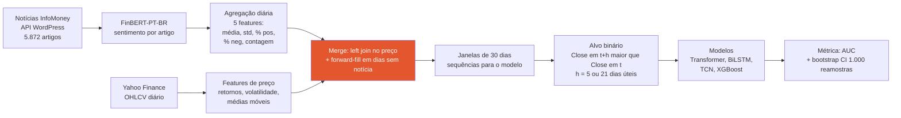
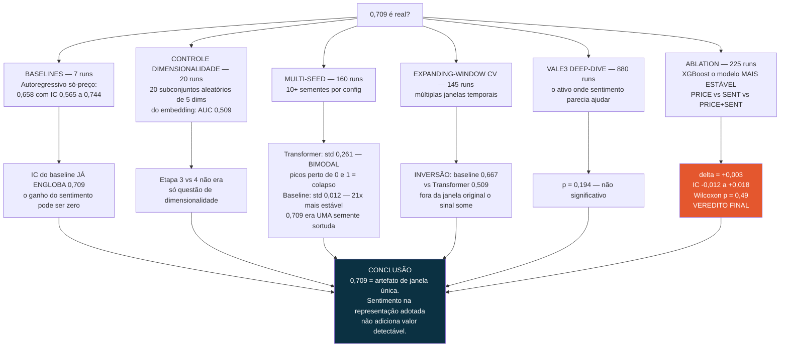
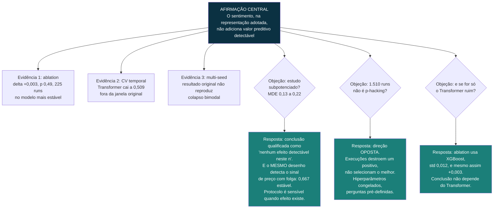

# Mapa lógico do TCC — para entender e explicar

> Tese em uma frase: **"Obtive AUC 0,709 usando sentimento de notícias, desconfiei, rodei ~1.510 execuções e provei que era artefato de janela única — o sentimento não adiciona valor detectável (Δ = +0,003, p = 0,49)."**

---

## 1. Visão geral — o arco completo

**Como narrar:** pergunta → construí o pipeline → resultado positivo bonito → mas três coisas cheiravam mal → ataquei o próprio resultado → ele morreu → a lição metodológica é a contribuição.

---

## 2. Pipeline de dados — como o dado vira predição

**Ponto sensível (em coral): o merge.** Forward-fill propaga o *passado* — não vaza futuro. O risco real é intradiário: notícia publicada após fechamento atribuída ao dia t. Direção do viés favorece o sentimento → o resultado nulo é limite superior otimista.

---

## 3. A investigação — cada experimento mata uma explicação

**Lógica da sequência:** cada experimento fecha uma porta de escape.
- "Mas o baseline pode ser fraco" → não, 0,658 com IC largo.
- "Mas pode ser dimensionalidade" → não, 5 dims aleatórias dão 0,509.
- "Mas pode ser azar de semente" → é o contrário: 0,709 foi *sorte* de semente (bimodal).
- "Mas pode ser a janela" → exato: fora dela, inverte.
- "Mas o Transformer é instável, não prova nada" → por isso ablation com XGBoost (std 0,012): Δ = +0,003.

---

## 4. Estrutura do argumento — por que a conclusão se sustenta

---

## 5. O que o trabalho NÃO afirma (escopo — decorar)

---

## 6. Os 6 protocolos (a contribuição prática)

| # | Protocolo | Qual experimento o motiva |
|---|---|---|
| 1 | Reportar IC bootstrap | Baseline 0,658 [0,565; 0,744] já englobava 0,709 |
| 2 | ≥ 10 sementes | Multi-seed revelou std 0,261 e bimodalidade |
| 3 | Expanding-window CV | Inversão 0,667 vs 0,509 entre janelas |
| 4 | Baseline autoregressivo | Sem ele, 0,709 parecia bom em absoluto |
| 5 | Monitorar distribuição de predições | Bimodal = assinatura do colapso degenerado |
| 6 | Auditar correlação validação-teste | Janela única esconde anticorrelação val-teste |

Origem: López de Prado (2018). Contribuição do TCC: mostrar **a magnitude do dano** de ignorá-los em dados brasileiros (0,709 → ~0,51).

---

## 7. Números na ponta da língua

| Número | O que é | Onde usar |
|---|---|---|
| **0,709** | AUC Transformer+FinBERT, janela única — o artefato | Início da história |
| **0,658 [0,565; 0,744]** | Baseline autoregressivo, janela única | Primeiro sinal: IC engloba 0,709 |
| **0,261 vs 0,012** | std multi-seed: Transformer vs baseline (21×) | Instabilidade |
| **0,667 vs 0,509** | AUC médio sob CV: baseline vs Transformer | A inversão |
| **+0,003, p = 0,49** | Ganho do sentimento na ablation (225 runs) | Veredito final |
| **p = 0,194** | VALE3 deep-dive, 880 runs | Mata o "mas na VALE3 funcionava" |
| **~1.510** | Total de execuções | Credibilidade da investigação |
| **5.872** | Artigos (2.572 ITUB4 / 1.775 PETR4 / 1.525 VALE3) | Dados |
| **0,13–0,22** | MDE (efeito mínimo detectável) | Resposta à objeção de poder |
| **61,4%** | Variância retida por PCA 32 comps (só treino) | Defesa do embedding |

---

## 8. Roteiro de 60 segundos (elevator pitch)

1. **Pergunta:** sentimento de notícias melhora predição de direção na B3?
2. **Fiz:** pipeline completo — 5.872 notícias, FinBERT-PT-BR, 4 arquiteturas.
3. **Achei:** AUC 0,709, compatível com a literatura. Parecia sucesso.
4. **Desconfiei:** matriz de confusão degenerada, sem IC, uma semente, uma janela.
5. **Testei:** 13 experimentos, ~1.510 execuções, hiperparâmetros congelados.
6. **Descobri:** o resultado era artefato de janela única. Sentimento: Δ = +0,003, p = 0,49. O baseline de preço puro (0,667) vence tudo sob validação rigorosa.
7. **Contribuição:** demonstração quantificada do viés de janela única em dados brasileiros + 6 protocolos mínimos para ML financeiro.
